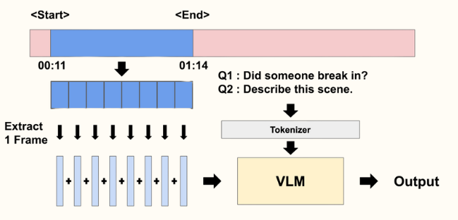

# BTS_graduate_project

## Project Overview  
This repository implements a deep learning pipeline for **video-based anomaly detection**. Datasets are constructed via `dataset.py`, various models are defined under the `model/` directory, training is performed with `train.py` and `single_train.py`, and real-time or batch inference is supported by `inference.py`.

## Full Pipeline



### Pipeline Description

1. **Clip Extraction**  
   - Trim the original video to the desired `start`–`end` timestamp.

2. **Frame Sampling**  
   - Uniformly sample N frames from the trimmed clip.

3. **Question Definition**  
   - e.g., `Q1: Did someone break in?`  
   - e.g., `Q2: Describe this scene.`

4. **Tokenizer**  
   - Tokenize the text questions into input sequences understandable by the VLM.

5. **VLM (Vision–Language Model)**  
   - Fuse the extracted frame features with the tokenized questions and process them multimodally.

6. **Output**  
   - Generate descriptive answers or predictions about the anomaly.

## Detector Structure


### Detector Module

The Detector consists of three main stages:

1. **Encoder**  
   A CNN-based backbone (e.g., ResNet-50) that extracts spatial features from each frame and produces per-frame embedding vectors.

2. **GRU**  
   A Gated Recurrent Unit that takes the sequence of embeddings as input to model temporal continuity and learns dynamic changes across frames.

3. **MLP**  
   A multilayer perceptron that takes the final hidden state from the GRU and regresses an **Anomaly Score**.

---
## Directory Structure

```plaintext
BTS_graduate_project/
├── model/
│   └── model.py
├── utils/
│   ├── check_ROI.py
│   ├── inf_utils.py
│   └── video_vlm.py
├── dataset.py
├── train.py             # Multi-GPU training on the full dataset
├── single_train.py      # Single-video training script
├── inference.py         # Anomaly detection inference script
├── requirements.txt     # List of dependencies
├── .gitignore
└── README.md
```
## Prepare Dataset

You can download the dataset from AIHUB: [AIHUB Anomaly Detection Dataset](https://www.aihub.or.kr/aihubdata/data/view.do?currMenu=115&topMenu=100&dataSetSn=71850)

## Jetson Container Setup

To run this project on NVIDIA Jetson devices, pull and launch NVIDIA’s official PyTorch container:

```bash
# 1) Log in to NVIDIA GPU Cloud (if required)
docker login nvcr.io

# 2) Pull the Jetson PyTorch container
docker pull nvcr.io/nvidia/l4t-pytorch:r32.7.1-pth1.10-py3

# 3) Run the container with GPU and volume mounts
docker run --runtime nvidia \
  --network host \
  -v $(pwd):/workspace \
  -w /workspace \
  -it nvcr.io/nvidia/l4t-pytorch:r32.7.1-pth1.10-py3 \
  /bin/bash
```

## Installation & Setup

1. Clone the repository
   ```bash
   git clone https://github.com/jhcho53/BTS_graduate_project.git
   cd BTS_graduate_project

2. Create & activate Python environment  
   ```bash
   conda env create -f environment.yml
   conda activate bts

3. Train the model
   ```bash
   python train.py \
   --data_root $BTS_DATA_ROOT \
   --epochs 50 \
   --batch_size 16 \
   --cuda
4. Evaluate the model
   ```bash
   python eval.py
5. Run inference
   ```bash
   python inference.py --video $Video_Root \
   --model $Model_Root\
   
