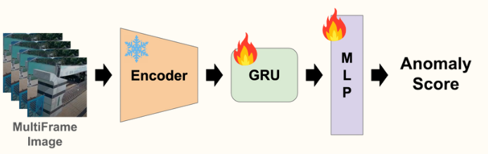

# BTS_graduate_project

## 프로젝트 개요
본 프로젝트는 **영상 기반 이상 행동(Anomaly) 탐지**를 목적으로 한 딥러닝 파이프라인을 구현한 리포지터리입니다.  
`dataset.py`를 통해 데이터셋을 구성하고, `model/` 디렉토리 내 다양한 모델을 정의하여 `train.py`와 `sigle_train.py`로 학습을 수행하며, `inference.py`로 실시간 또는 배치 추론을 지원합니다.

## Detector Structure


### Detector

Detector 모듈은 크게 3단계로 구성됩니다:

1. **Encoder**  
   연속된 프레임들의 공간적 특징을 추출하는 CNN 기반 백본(예: ResNet-50)으로, 프레임별 임베딩 벡터를 생성합니다.

2. **GRU**  
   시퀀스별 임베딩을 입력으로 받아, 시간적 연속성을 모델링하는 Gated Recurrent Unit 으로 프레임 간의 동적 변화를 학습합니다.

3. **MLP**  
   GRU로부터 나온 최종 은닉 상태를 입력으로 받아 **Anomaly Score**를 회귀적으로 예측하는 다층 퍼셉트론입니다.

---

## 디렉토리 구조

```plaintext
BTS_graduate_project/
├── model/
│   └── model.py
├── utils/
│   ├── check_ROI.py
│   ├── inf_utils.py
|   └── video_vlm.py
├── dataset.py
├── train.py             # 전체 데이터셋 기반 멀티-GPU 학습
├── single_train.py      # 단일 비디오 학습 스크립트
├── inference.py         # 이상 탐지 추론 스크립트
├── requirements.txt     # 의존성 목록
├── .gitignore
└── README.md
```

## 설치 및 환경 설정

1. 저장소 클론  
   ```bash
   git clone https://github.com/jhcho53/BTS_graduate_project.git
   cd BTS_graduate_project

2. Python 가상환경 생성  
   ```bash
   conda env create -f environment.yml
   conda activate bts

3. Train model
   ```bash
   python train.py \
   --data_root $BTS_DATA_ROOT \
   --epochs 50 \
   --batch_size 16 \
   --cuda
4. Evaluate model
   ```bash
   python eval.py
5. Inference model
   ```bash
   python inference.py --video $Video_Root \
   --model $Model_Root\
   
